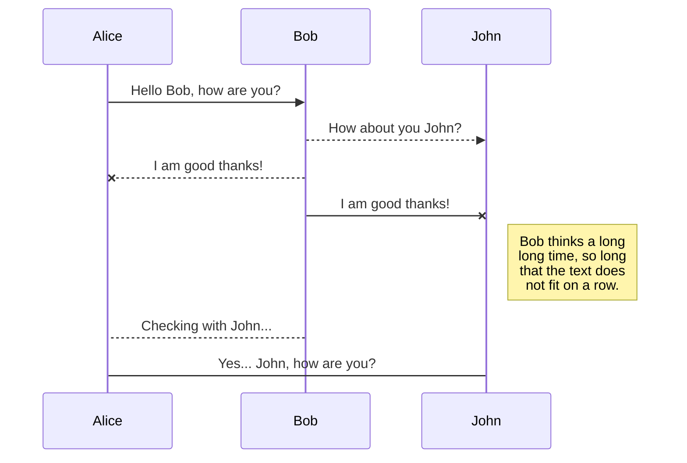
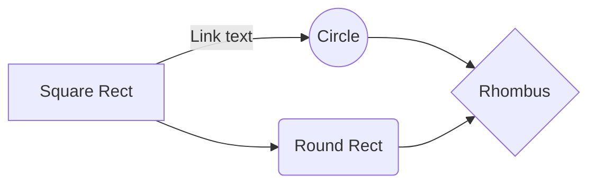

## [Paginate Cache - Material React Redux Saga Template](https://www.linkedin.com/in/joey-dong-032b9013a/) [](https://www.linkedin.com/in/joey-dong-032b9013a/)

 [](https://github.com/devias-io/react-material-dashboard/issues?q=is%3Aopen+is%3Aissue) [](https://github.com/devias-io/react-material-dashboard/issues?q=is%3Aissue+is%3Aclosed) [](https://discord.gg/BSHaUGR)


> Free React, Redux with Redux-Saga template made with [Material UI's](https://material-ui.com/?ref=devias-io) components, [React](https://reactjs.org/?ref=devias-io), [Redex](https://redux.js.org/introduction/getting-started), and  [Redex-Saga](https://redux-saga.js.org/docs/introduction/BeginnerTutorial.html) to boost your app development process! Example API feteching, interaction between React Component and Redux are implemented. Rich comments throught the template will explain more details and intentions.

 "Optional title")
## Table of Contents

- [Quick Start](#quick-start)
- [Implementation](#implementation)
- [File Structure](#file-structure)
- [Resources](#resources)
- [Reporting Issues](#reporting-issues)
- [Licensing](#licensing)
- [Contact Us](#contact-us)

## Quick start

- [Download from Github](https://github.com/JoeyDon/Accenture-Paginate-Cache/archive/master.zip)  or clone the repo: 
`git clone https://github.com/devias-io/react-material-dashboard.git`

- Install dependencies: 
`npm install` or `yarn`

- Start the server: 
`npm run start` or `yarn start`

- Views are on: 
`localhost:3000`

## Implementation

The documentation for the React Material Kit is can be found [here](https://material-ui.com?ref=devias-io).

## File Structure

Within the download you'll find the following directories and files:

```
Accenture-Paginate-Cache
├── .gitignore
├── package.json
├── package-lock.json
├── yarn.lock
├── README.md
├── public
└── src
	├── components
	│	├── cards
	│	│	├── Card.jsx
	│	│	├── CardDetails.jsx
	│	│	└── Cards.jsx
	│	├── home
	│	│	├── Home.test.js
	│	│	└── Home.jsx	
	│	├── loading
	│	│	├── LoadingCircle.jsx
	│	│	└── LoadingLinear.jsx
	│	├── pagination
	│	│	└── Pagination.jsx	
	│	├── App.test.js
	│	└── App.jsx
	├── reducers
	│	├── cacheReducer.js
	│	├── dataReducer.js	
	│	├── index.js	
	│	├── lastpageReducer.js	
	│	└── paginationReducer.js	
	├── settings	
	│	└── settings.js
	├── utils
	│	├── testUtils.js
	│	└── paginate.js
	├── action.js
	├── api.js
	├── index.js
	├── registerServiceWorker.js
	├── saga.js
	└── store.js
```

## Resources

- Material-UI, the world's most popular React UI framework. : <https://material-ui.com/>

## Reporting Issues:

- [Github Issues Page](https://github.com/devias-io/react-material-dashboard/issues?ref=devias-io)

## Design Files

- Licensed under MIT (https://github.com/devias-io/react-material-dashboard/blob/master/LICENSE.md)

## Contact Us

- Email me: Joey.don0905@gmail.com
- [Check me out on Linkedin](https://www.linkedin.com/in/joey-dong-032b9013a/)


## UML diagrams

You can render UML diagrams using [Mermaid](https://mermaidjs.github.io/). For example, this will produce a sequence diagram:



And this will produce a flow chart:


